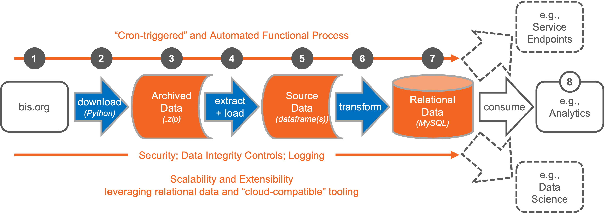

# Lane Whitmore
## M.S. Data Science
### University of San Diego

# [Project 1: BIS Automated Pipeline](https://github.com/lanewhitmore/BIS_Data_Pipeline)
- Constructed an ELT Pipeline that extracts information from the BIS statistical website to a relational database in MySQL.
- Constructed automation through a .bat file that performs ELT in approximately 3 minutes.
- Performed automated analytics dashboarding in addition to prepping data for future use cases.
[Architecture for BIS Pipeline:](https://github.com/lanewhitmore/lanewhitmore.github.io/blob/main/images/bis_pipe_flow.png)

# [Project 2: Indian Rent Prediction](https://github.com/lanewhitmore/Rent_Prediction)
- Constructed an application that predicts rental prices in Indian cities in both Indian Rupee and USD.
- Deployed and compared multiple machine learning algorithms to identify the most effective. 
- Built an ensemble method that predicts monthly rental prices with around a $100 mean absolute error (MAE). 
- [Built a client facing API using StreamLit.](https://lanewhitmore-rent-prediction-rent-app-eda---whitmore-vd5d0e.streamlit.app/)

[Part of the exploration process:](https://github.com/lanewhitmore/lanewhitmore.github.io/blob/main/images/exploration.png)

[Final results table evaluating MAE:](https://github.com/lanewhitmore/lanewhitmore.github.io/blob/main/images/rentresults.png)

# [Project 3: Naticus-Droid Malware Classification](https://github.com/lanewhitmore/NATICUSdroid-Malware-Machine-Learning-Classification)
- Constructed and compared multiple machine learning algorithms. 
- Tuned the algorithms based on the primary business objective, to classify as many Android Malware applications as possible.
- Built a Random Forest ensemble method that has 99.8% precision with 95% overall accuracy. 

[Random Forest Confusion Matrix:](https://github.com/lanewhitmore/lanewhitmore.github.io/blob/main/images/randomforestcm.png)

[Final Results ROC Curves:](https://github.com/lanewhitmore/lanewhitmore.github.io/blob/main/images/naticusroc.png)

# [Project 4: Earth Land Temperature Time Series Forecasting](https://github.com/stephenkuc/ADS506_FinalProj)
- Crafted decomposition charts to identify the weather trends across the six continents. 
- Created a 75 year linear regression forecast that identified warming trends. 
- Forecasts pointed out Australian and Asian temperatures rising more rapidly than North America.
